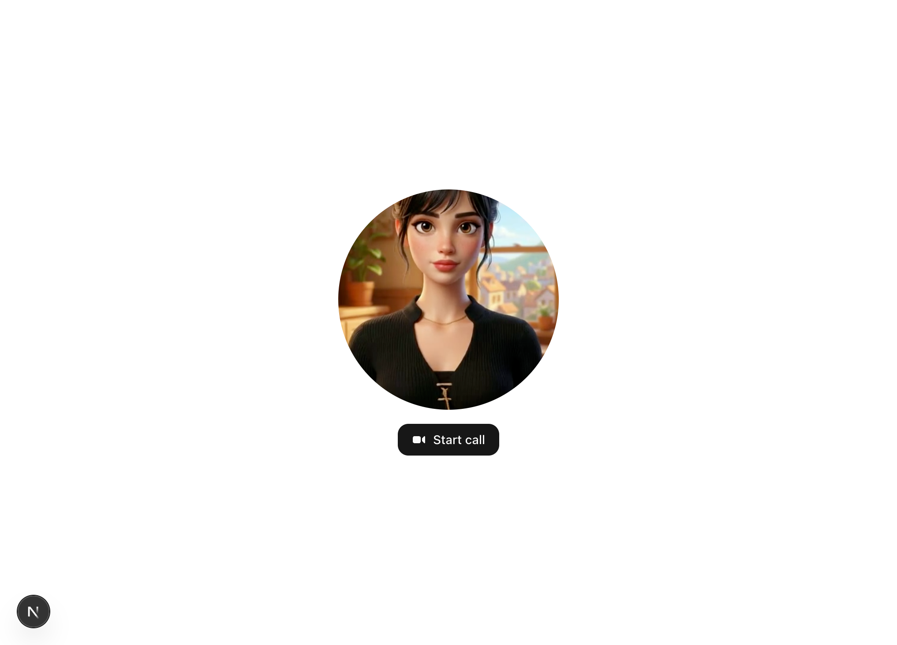

# livekit-app-python

End-to-end example showing how to use the LemonSlice Self-Managed Pipeline with LiveKit integration. Use this when you want full control over your video agent pipeline (for example, with your own STT, LLM, and TTS components) while LemonSlice handles avatar generation; orchestration, infrastructure, and UI remain in your stack, with the LiveKit agent built using the [LiveKit Python SDK](https://github.com/livekit/agents).

## Screenshots

<table>
  <tr>
    <td align="center" valign="top" width="50%">
      <br />
      <sub>Before joining</sub>
    </td>
    <td align="center" valign="top" width="50%">
      <br />
      <sub>In a call</sub>
    </td>
  </tr>
</table>

Project layout:


| Path                                         | What                             |
| -------------------------------------------- | -------------------------------- |
| **Next.js app** (repo root) and `/api/token` | Frontend and token server        |
| `agent/`                                     | Python **LiveKit Agents** worker |


## Setup

1. **Environment** — copy and edit at the **repo root** (both Next and the worker read `.env.local` here):
  ```bash
   cp .env.example .env.local
  ```

  | Variable(s)                                            | Used by                                                                                            |
  | ------------------------------------------------------ | -------------------------------------------------------------------------------------------------- |
  | `LIVEKIT_URL`, `LIVEKIT_API_KEY`, `LIVEKIT_API_SECRET` | Next token route, agent room connection, and **LiveKit Inference** (STT + LLM + TTS)               |
  | `AGENT_NAME`                                           | Worker registration / dispatch — include in `.env.local` (default `lemonslice` in `.env.example`). |
  | `LEMONSLICE_API_KEY`                                   | Find this in your [LemonSlice account page](https://lemonslice.com/account).                       |

  **Video ready** — Avatar video needs a few seconds. The agent sends a `bot_ready` RPC on the `lemonslice` data topic; the UI listens for that, then shows the full in-call layout with the live avatar (not on participant join alone).
2. **Install** — install `[uv](https://docs.astral.sh/uv/getting-started/installation/)` first, then:
  ```bash
   npm install
   cd agent && uv sync
  ```

## Run locally

Pick **one** of these—do not run both at once.

**Default (simplest): one command**

Starts the Next.js app (UI + token API) and the agent worker together:

```bash
npm run dev:all
```

Open [http://localhost:3000](http://localhost:3000), join a room in the browser; with default dispatch, the worker should enter the same LiveKit project.

**Alternative: two terminals**

Same result, but you run each process yourself:


| Terminal | Command             | What it runs                                                    |
| -------- | ------------------- | --------------------------------------------------------------- |
| **A**    | `npm run dev`       | Web + `/api/token` (Next.js)                                    |
| **B**    | `npm run dev:agent` | Agent worker (`uv run python src/agent.py dev` inside `agent/`) |


Open [http://localhost:3000](http://localhost:3000) after **A** is up.

## Deploy

- **Next app** (e.g. Vercel): set `LIVEKIT_*` in project env. Do not expose API secret to the client.
- **Agent**: deploy separately ([LiveKit agent deployment](https://docs.livekit.io/agents/ops/deployment/)) with the same `LIVEKIT_*`, plus `LEMONSLICE_API_KEY`.

## How the token server works with LiveKit

Browsers cannot safely hold `LIVEKIT_API_SECRET`. So **only your server** (here: `src/app/api/token/route.ts`) uses the secret to **sign** a JWT. The browser calls your app, gets `{ token, serverUrl, room }`, then the LiveKit client library connects to `serverUrl` (your `LIVEKIT_URL`) using `token`.

**Token API (reference)**

- `GET` or `POST` `/api/token`
- Query: optional `room`, `participant`
- Response: `{ token, serverUrl, room }`

## Agent source

See `agent/src/agent.py`. **LLM** and **STT** use `inference.LLM` and `inference.STT`. **TTS** uses `inference.TTS` with an `elevenlabs/…` model—not Python `livekit.plugins.elevenlabs` or Node `[@livekit/agents-plugin-elevenlabs](https://www.npmjs.com/package/@livekit/agents-plugin-elevenlabs)`. Swap `AGENT_IMAGE_URL` / models in that file as needed.

### ElevenLabs: inference vs the plugin

This repo routes ElevenLabs **through LiveKit Inference** instead of the dedicated ElevenLabs plugin.


| Topic          | **LiveKit Inference (`inference.TTS`)** — *this repo*                                                                                                                                                                                                                                                                                            | `livekit.plugins.elevenlabs` / `@livekit/agents-plugin-elevenlabs`                                                                  |
| -------------- | ------------------------------------------------------------------------------------------------------------------------------------------------------------------------------------------------------------------------------------------------------------------------------------------------------------------------------------------------ | ----------------------------------------------------------------------------------------------------------------------------------- |
| **Auth**       | Same `LIVEKIT_API_KEY` / `LIVEKIT_API_SECRET` as LLM and STT (JWT to the inference gateway). No ElevenLabs API key in env.                                                                                                                                                                                                                      | Set `ELEVENLABS_API_KEY` (or the env name your plugin version expects) from the [ElevenLabs dashboard](https://elevenlabs.io/).    |
| **Voices**     | Only **default** voices listed in the [ElevenLabs inference voice table](https://docs.livekit.io/agents/models/tts/inference/elevenlabs/#voices). Example in code: **Jessica** with `elevenlabs/eleven_turbo_v2_5` and voice id `cgSgspJ2msm6clMCkdW9`. Custom/community voices from your ElevenLabs account are **not** available on this path. | Use `voice_id` (Python) / `voiceId` (Node) for any voice your API key can access (including custom voices).                         |
| **Code shape** | `inference.TTS(model="elevenlabs/eleven_turbo_v2_5", voice="…", language="en")` — parameter is `voice`, not `voice_id`.                                                                                                                                                                                                                        | Plugin: `voice_id` / `voiceId` (e.g. `elevenlabs.TTS(voice_id="…")` in Python, `new elevenlabs.TTS({ voiceId: "…", … })` in Node). |


