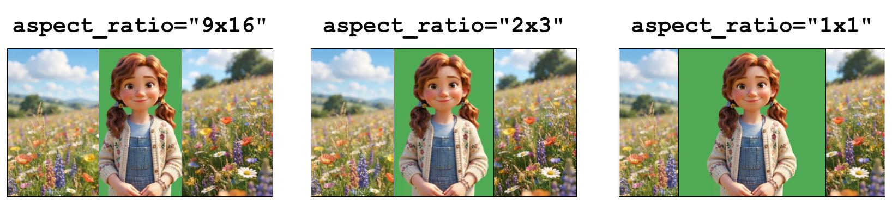

# green-screen-landscape-demo

End-to-end example demonstrating how to perform **client-side [chroma key compositing](https://en.wikipedia.org/wiki/Chroma_key)** with a LemonSlice avatar. A Next.js app provides the UI (including a WebGL chroma key shader) and issues room tokens; a Python LiveKit Agents worker runs your pipeline and uses LemonSlice for the avatar.

The LemonSlice avatar is generated at a 2:3 (vertical) aspect ratio, and inserted into a 16:9 (horizontal) container. Chroma key compositing is performed client-side to replace a green-screen background with an animated background.

## Demo


https://github.com/user-attachments/assets/aef009dd-9e55-4b46-93f4-36ab975ef191


Project layout:

| Path                                         | What                             |
| -------------------------------------------- | -------------------------------- |
| **Next.js app** (repo root) and `/api/token` | Frontend, chroma key, token API  |
| `agent/`                                     | Python **LiveKit Agents** worker |
| `src/lib/chroma-key/`                        | WebGL chroma key renderer        |

## Setup

1. **Environment** — copy and edit at the **repo root**:

   ```bash
   cp .env.example .env.local
   ```

   | Variable(s)                                            | Used by                                                                                            |
   | ------------------------------------------------------ | -------------------------------------------------------------------------------------------------- |
   | `LIVEKIT_URL`, `LIVEKIT_API_KEY`, `LIVEKIT_API_SECRET` | Next token route and agent room connection.                                                        |
   | `LIVEKIT_AGENT_NAME`                                   | LiveKit worker registration / dispatch name.                                                       |
   | `AGENT_IMAGE_URL`                                      | Avatar reference image for the agent worker.                                                        |
   | `LEMONSLICE_API_KEY`                                   | Find this in your [Developer Portal](https://lemonslice.com/developers).                       |
   | `GROQ_API_KEY`                                         | Groq API key for the LLM (`llama-3.3-70b-versatile`).                                              |
   | `ELEVENLABS_VOICE_ID`, `ELEVEN_API_KEY`                | ElevenLabs voice and API key for TTS (`eleven_flash_v2_5`).                                        |

   **Video ready** — The UI uses [`@lemonsliceai/avatar`](https://www.npmjs.com/package/@lemonsliceai/avatar) to signal when the avatar is ready to be displayed.

2. **Install** — install [uv](https://docs.astral.sh/uv/getting-started/installation/) first, then:

   ```bash
   npm install
   cd agent && uv sync && cd ..
   ```

## Run locally

**Default: one command**

```bash
npm run dev:all
```

Open [http://localhost:3000](http://localhost:3000) and start a call.

**Alternative: two terminals**

| Terminal | Command             | What it runs                                                    |
| -------- | ------------------- | --------------------------------------------------------------- |
| **A**    | `npm run dev`       | Web + `/api/token` (Next.js)                                    |
| **B**    | `npm run dev:agent` | Agent worker (`uv run python src/agent.py dev` inside `agent/`) |

## Chroma key tuning

All tuning lives in `src/lib/constants.ts`.

### Key color

| Constant | What it does |
| -------- | ------------ |
| `CHROMA_KEY_HEX` | Hex color of the greenscreen background used in your reference image (e.g. `#50A954`). |

### Key matte (`CHROMA_KEY_OPTIONS`)

These control how pixels are keyed out. See `src/lib/chroma-key/createChromaKeyRenderer.ts` for the shader logic.

| Parameter | Typical range | Effect |
| --------- | ------------- | ------ |
| `similarity` | 0.05–0.20 | How close a pixel's RGB must be to `CHROMA_KEY_HEX` to count as background. **Higher** = more aggressive (keys more green, but can eat into the subject). |
| `smoothness` | 0.04–0.12 | Width of the transition between keyed and opaque. **Lower** = harder edge. |
| `spillMin` | 0.02–0.08 | Green-excess (`g - max(r,b)`) above which spill removal starts. **Lower** = catches faint green fringing on light hair/skin sooner. |
| `spillMax` | 0.08–0.15 | Green-excess at which spill is fully keyed out. **Lower** = tighter spill removal. |
| `edgeFeatherPx` | 0–3 | Post-process alpha softening at the silhouette edge (0 = off). Does **not** change the key matte — only blurs alpha after the fact. RGB stays sharp. |

**Green fringing on edges** — raise `similarity` slightly, or lower `spillMin` / `spillMax`.

**Subject clipping** — lower `similarity`, or raise `spillMin`.

**Jagged edges** — try `edgeFeatherPx: 1` or `2`.

Set the reference image via `AGENT_IMAGE_URL` in `.env.local` (agent worker only). The pre-call and ringing UI loop `public/placeholder.mp4`.

## Avatar aspect ratio

When using a green screen, you may wish to experiment with different aspect ratios. Supported API values are `2x3` (default), `9x16`, and `1x1`. This controls how your avatar image will be center-cropped (i.e. what part of your reference image will be animated). Vertical aspect ratios generally produce the best results for humanoid characters, as they reduce deadspace and improve perceived resolution. However, you may wish to use a wider aspect ratio (e.g. `1x1`) if the extremities are cut off during gestures. The schematic below shows how different aspect ratios can be embedded into the same 16:9 front-end container. Note that `9x16` would be a poor choice for this image, since it crops the body, thus ruining the green-screen illusion.



By default this demo uses **2x3**. To switch, update both places:

**1. Agent** — `agent/src/agent.py`:

```python
avatar = lemonslice.AvatarSession(
    agent_image_url=AGENT_IMAGE_URL,
    agent_prompt="A person talking.",
    aspect_ratio="1x1",
)
```

**2. Frontend** — `src/lib/constants.ts`:

```typescript
export const AVATAR_ASPECT_RATIO = 1; // 2 / 3 for "2x3"
```
