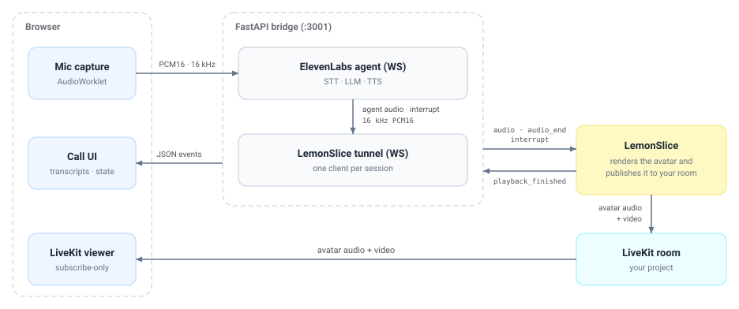

# websocket-app

Build with the **LemonSlice WebSocket integration**: drive a LemonSlice avatar from your own audio stack by streaming PCM16 over a WebSocket, while the avatar's video comes back over LiveKit. This example wires an [ElevenLabs agent](https://elevenlabs.io/docs/agents-platform/overview) to that WebSocket through a small FastAPI bridge, but the bridge is the reusable part — swap ElevenLabs for any speech source that produces audio.

The WebSocket carries **only audio and control events**. Avatar video is published into a LiveKit room that you own; your app joins that room as a viewer.

https://github.com/user-attachments/assets/394224a6-59d3-42b4-8c99-c67816dbd24e

## How the integration works



1. **Create a session.** `POST https://lemonslice.com/api/liveai/sessions` with `transport_type: "websocket-livekit"`, a LiveKit URL + a publish token (so LemonSlice can join your room), and an avatar image. It returns a `websocket_address`.
2. **Open the tunnel.** Connect a plain WebSocket to `websocket_address`. Only one client may be connected per session.
3. **Stream a turn.** Send `audio` frames, then an `audio_end` to commit the turn. LemonSlice renders the avatar and publishes it into your LiveKit room.
4. **Watch.** Join the same room with a subscribe-only viewer token to display the avatar.

## WebSocket protocol

All frames are JSON text. 

Client → LemonSlice:

```jsonc
{ "command": "audio", "audio": "<base64 PCM16 mono>", "sampleRate": 16000, "encoding": "PCM16" }
{ "command": "audio_end" }  // commit the turn — required before anything renders
{ "command": "interrupt" }  // cut off the current response
{ "command": "terminate" }  // end the session, then close the socket
```

LemonSlice → client:

```jsonc
{ "command": "playback_finished", "playback_position": 4.2, "interrupted": false }
```

### Turn flow

- **Always send `audio_end` at the end of a turn.** A turn is `audio → audio → … → audio_end`. It tells LemonSlice the response is complete. Without it the avatar freezes on the last frame and trailing audio from the end of the response may be truncated.
- **Only send `interrupt` while a response is playing.** After LemonSlice reports `playback_finished`, the response is done and an `interrupt` does nothing.

## Layout

| Path | What |
| --- | --- |
| **Next.js app** (repo root), `src/` | Call UI, LiveKit viewer, mic capture, bridge WebSocket client |
| `public/worklets/mic-processor.js` | Captures the mic as 16 kHz mono PCM16 |
| `backend/` | FastAPI bridge (`uv` project, package `lemonslice_bridge`) |
| `backend/src/lemonslice_bridge/lemonslice.py` | Session creation + the tunnel WebSocket client |
| `backend/src/lemonslice_bridge/bridge.py` | Turn commits, interrupt gating, stale-audio dropping |
| `backend/src/lemonslice_bridge/elevenlabs.py` | ElevenLabs agent WebSocket client |
| `backend/src/lemonslice_bridge/audio.py` | PCM16 / mu-law / resampling |
| `backend/src/lemonslice_bridge/rooms.py` | LiveKit tokens (publish for LemonSlice, subscribe for the browser) |

## Setup

Requires Node 18+, Python 3.11+, and [uv](https://docs.astral.sh/uv/getting-started/installation/).

```bash
cp .env.example .env.local   # then fill it in
npm install
cd backend && uv sync && cd ..
```

| Variable | Required | Purpose |
| --- | --- | --- |
| `LEMONSLICE_API_KEY` | yes | [Developer portal](https://lemonslice.com/developers) |
| `ELEVENLABS_AGENT_ID` | yes | The public agent to converse with |
| `LIVEKIT_URL` / `LIVEKIT_API_KEY` / `LIVEKIT_API_SECRET` | yes | Avatar A/V egress |

Change `AGENT_IMAGE_URL` in `backend/src/lemonslice_bridge/lemonslice.py` to use your own avatar portrait.

## Run

```bash
npm run dev:all
```

Open [http://localhost:3000](http://localhost:3000) and click **Start call**. Or run the two processes separately: `npm run dev` and `npm run dev:backend`.

## How a turn flows through the bridge

1. The browser captures the mic at 16 kHz mono PCM16 in an `AudioWorklet` and pushes 50 ms chunks up the bridge WebSocket as binary frames.
2. The bridge forwards them to ElevenLabs, which streams back `audio` events. Each chunk is normalised to 16 kHz PCM16 and sent to LemonSlice as an `audio` command.
3. ElevenLabs delivers a response's audio faster than realtime and follows it with an `agent_response` event carrying the full text. That event is the end-of-response marker: the bridge queues `audio_end` behind the audio already in flight, committing the turn exactly once.
4. LemonSlice publishes the avatar into LiveKit and replies with `playback_finished`.
5. When the user talks over the avatar, ElevenLabs emits an interruption; the bridge drops queued audio and sends `interrupt` — but only while a response is still outstanding. The **Interrupt** button drives the same path manually.
