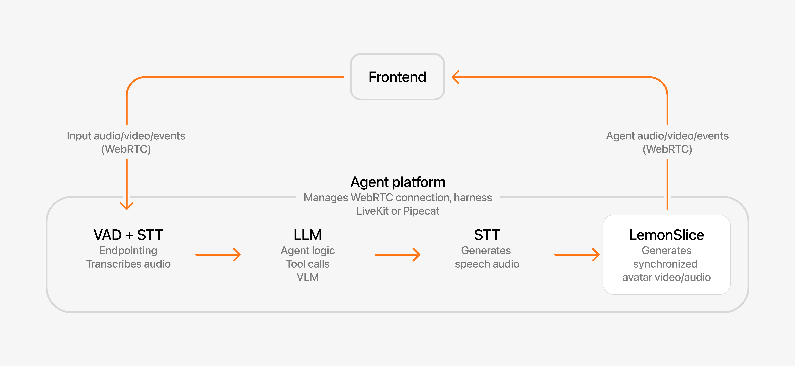

# LemonSlice Examples

Build interactive avatars that can listen, talk and respond directly inside your product or website using the LemonSlice API.

- ✓ [Ultra-low latency](https://lemonslice.com/blog/lemonslice-flash)
- ✓ 1000+ concurrency
- ✓ Multi-hour long calls
- ✓ Instant avatar creation (1 photo)
- ✓ 5-minute API setup

[](https://youtu.be/bQf5h0WD-48)

## The most advanced interactive avatar model

[LemonSlice](https://lemonslice.com/) is an AI research lab building the world’s first **Character World Model**: interactive characters that talk, listen, and react in real-time based on your conversations. Character World Models are more advanced than traditional real-time avatars, which are based on deepfake or older generative technology.

Capabilities include hand gestures, on-the-fly emotions, holding objects, clothing swaps, physics modeling, non-human and cartoon characters, full-body movement, and photorealism. Create any character from a **single image** — no training or fine-tuning required.

## How it works

Every real-time conversation with a character goes through the following steps:

1. A speech-to-text (**STT**) and voice-activity detection (**VAD**) model listen to the user
2. An **LLM** decides what to say back
3. Text-to-speech (**TTS**) turns the reply into audio
4. **LemonSlice** turns the audio into a real-time video of the character speaking within a live video call

All of this runs within a harness that manages the orchestration and WebRTC connection. LemonSlice connects to all major WebRTC providers to make orchestration easy.



The inputs to the LemonSlice API are:

1. **Image** — defines the appearance of your character
2. **Audio** — streaming audio from a TTS model like ElevenLabs or Cartesia. This audio is exactly what your character will say.
3. (optional) **Action Engine** — determines what actions (waving, holding a phone, looking away) the character should take during the conversation. Currently Enterprise only.

**Note**: The quality of your avatar is _heavily_ determined by your image. See [Avatar Image Tips](https://lemonslice.com/docs/prompting-guide/avatar-image-tips) for framing and posing tips.

## Integrate real-time avatars into your app

Add LemonSlice to the stack you already use. LemonSlice integrates with all major WebRTC providers like LiveKit, Daily/Pipecat, and Agora. These providers all have Conversational AI toolkits that make it simple to combine any LLM, TTS, and STT component with LemonSlice.

You can think of LemonSlice like a graphics layer or “face layer” that’s added on top of your voice agent. It is compatible with any TTS and LLM model.

| | **Self-managed** (LiveKit, Pipecat) | **Hosted pipeline** | **Widget** |
| --- | --- | --- | --- |
| **Complexity** | Full code | Low code | No code |
| **You control** | Speech, intelligence, call UI | Call UI | Nothing |
| **LemonSlice controls** | Avatar | Speech, intelligence, avatar | Speech, intelligence, avatar, call UI |
| **In this repo** | [03](./03-livekit-app-python/), [04](./04-livekit-app-nodejs/), [05](./05-pipecat-app/), [06](./06-form-demo/), [07](./07-livekit-zoom/), [08](./08-green-screen-landscape-demo/), [09](./09-realtime-image-change/) | [01-hosted-daily-app](./01-hosted-daily-app/) | — |

1. **Pick a framework** — [LiveKit](./03-livekit-app-python/) or [Pipecat](./05-pipecat-app/) integration guide.
2. **Build your UI** — run your own call lifecycle and frontend around the avatar session. See the [production checklist](https://lemonslice.com/docs/reference/production-checklist).

## Quickstart

**[03-livekit-app-python](./03-livekit-app-python/)** — Next.js frontend + LiveKit Agents worker (Python). A production-ready avatar app you can run locally in about 5 minutes.

```bash
cd 03-livekit-app-python
cp .env.example .env.local   # add LIVEKIT_* and LEMONSLICE_API_KEY
npm install && cd agent && uv sync && cd ..
npm run dev:all
```

Open [http://localhost:3000](http://localhost:3000). See the [setup guide](./03-livekit-app-python/README.md) for details.

## Call UI demo

Pre-join, ringing, and in-call flow shared by the LiveKit and Pipecat examples:

https://github.com/user-attachments/assets/0c889262-1021-4918-878d-722930ffda5f

## Examples

| | |
| --- | --- |
| **[03-livekit-app-python](./03-livekit-app-python/)** | End-to-end self-managed pipeline — Next.js UI, Python LiveKit Agents worker, LemonSlice avatar. |
| **[04-livekit-app-nodejs](./04-livekit-app-nodejs/)** | Same as `03`, with the agent in Node.js ([LiveKit Agents JS](https://github.com/livekit/agents-js)). |
| **[05-pipecat-app](./05-pipecat-app/)** | Same call UI as the LiveKit examples, using Daily + Pipecat instead. |
| **[02-livekit-playground-demo](./02-livekit-playground-demo/)** | Minimal agent for iterating in the [LiveKit playground](https://docs.livekit.io/home/cli/playground/). |
| **[01-hosted-daily-app](./01-hosted-daily-app/)** | Hosted pipeline — LemonSlice runs speech and intelligence; you build the frontend. |
| **[06-form-demo](./06-form-demo/)** | Tool calling in a LiveKit agent (AI SDR: email capture + meeting scheduling). |
| **[07-livekit-zoom](./07-livekit-zoom/)** | Send an avatar into Zoom, Meet, Teams, or Webex via LiveKit Agents. |
| **[08-green-screen-landscape-demo](./08-green-screen-landscape-demo/)** | Perform client-side green screen (chroma key) compositing to achieve a horizontal layout and animated background. |
| **[09-realtime-image-change](./09-realtime-image-change/)** | Change your avatar's reference image during a call in real-time using the `update-image` event. |

Each folder is self-contained with its own README and setup steps.

## Try the live demo

Try the full product at **[lemonslice.com](https://lemonslice.com)**.

## Docs

- [Introduction](https://lemonslice.com/docs/introduction) — product overview and integration options
- [LiveKit integration](https://lemonslice.com/docs/livekit)
- [Pipecat integration](https://lemonslice.com/docs/pipecat)
- [Production checklist](https://lemonslice.com/docs/reference/production-checklist)
